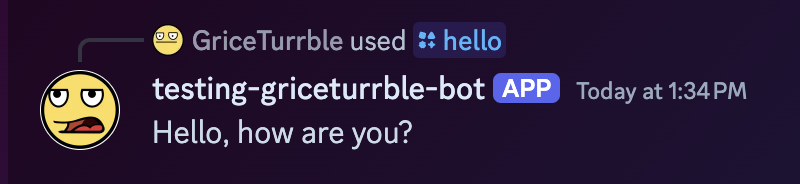

# DisBot: simple Discord bot template

A simple template for a [Discord](https://discord.com/) bot using [discord.py](https://discordpy.readthedocs.io/en/stable/).

## Getting started

0. Click "Use this template" (at top-right of the GitHub repo), then choose "Create a new repository",
   so you can work on your own version of this bot on your account. 🙂

1. Clone the project on your local machine.

2. Install necessary tooling to work on this project.

   If you use [Homebrew](https://brew.sh/),
   you can take advantage of our [`Brewfile`](Brewfile)
   to install the bundle of tools:

   ```shell
   brew bundle install
   ```

   Otherwise, please follow installation instructions for each of the following minimal tools:

   - [just](https://just.systems/), a command runner similar to Make.
   - [pre-commit](https://pre-commit.com/), a framework for managing pre-commit hooks (used for code quality).
   - [uv](https://docs.astral.sh/uv/), a Python package and project manager.

   Most other tooling uses the [`Justfile`](Justfile) recipes or standard `uv` commands.

   > [!note] > `uv` can handle Python installations for you, if you want it to.
   > Otherwise, you can install **Python 3.12** yourself from [python.org](https://python.org/downloads),
   > or use a version manager like [pyenv](https://github.com/pyenv/pyenv).

3. Bootstrap your environment using `just bootstrap`.

   > [!note]
   > Run `just help` (or `just` by itself) to display help documentation about the commands available in the Justfile.
   >
   > For more details on Just, refer to the [Just manual](https://just.systems/man/en/).

   This performs a few helpful steps, such as `pre-commit install` to get pre-commit hooks set up for you,
   and `uv sync` to initialize your Python virtual environment
   (you will find it as a `.venv` folder inside the project).

   You'll also find a new [.env](.env) file is added, containing some environment variable definitions:

   ```
   # Get your Discord token from the Discord dev console
   # THIS IS CONFIDENTIAL! DO NOT SHARE YOUR TOKEN!
   DISCORD_TOKEN=
   # Copy the guild ID (aka server ID) from a target private server.
   # If present, some commands become private to this guild only.
   # Otherwise, all commands are globally available for all bot installs.
   # DISCORD_GUILD=
   ```

4. If you don't have a Discord bot application set up in
   [Discord Developer portal](https://discord.com/developers/applications) yet,
   head there now and make one!

   Under the **Settings > Bot** section, create or reset your token. Copy this token into the `.env` file:

   ```
   DISCORD_TOKEN=superSecretTokenValue12345
   ```

   > [!warning]
   > Discord bot tokens are confidential, and should never be shared with anyone!
   > You may want to keep a copy of the token value in a password manager like (1Password or Bitwarden),
   > but otherwise it should _never_ be committed to your git repo!
   >
   > The `.env` file containing that secret remain ignored (via [`.gitignore`](.gitignore)),
   > and you should _only_ use the `DISCORD_TOKEN` environment variable to access it temporarily
   > (be wary of any `print()` or `logging` calls that may expose it, as well!).

5. Back in the [Discord Developer portal](https://discord.com/developers/applications),
   under **Settings > Installation**, select the option for installation you want.
   For testing on a private server, I recommend "Guild Install";
   and under Install Link, choose "Discord Provided Link".

   Save these settings, then copy the OAuth link that was created:

   ```
   https://discord.com/oauth2/authorize?client_id=12345...
   ```

   Paste this link into your browser, then follow Discord's authentication flow to invite the app to your server.

6. Finally, start the bot using either `uv run disbot` or the Justfile alias, `just up`:

   ```sh
   $ just up
   uv run disbot
   2024-12-30 16:31:26 WARNING  discord.ext.commands.bot Privileged message content intent is missing, commands may not work as expected.
   2024-12-30 16:31:26 INFO     discord.client logging in using static token
   2024-12-30 16:31:27 INFO     discord.gateway Shard ID None has connected to Gateway (Session ID: ...).
   my-bot#1234 is ready!
   ```

You should now be able to use the initial `/hello` command on your server, and get back a friendly response:



## Contributing

See [CONTRIBUTING.md](CONTRIBUTING.md).
