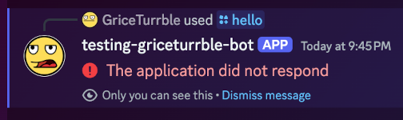
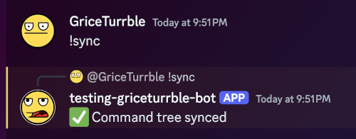
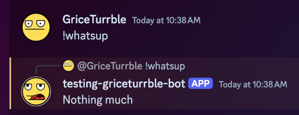
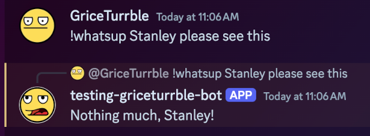

# Anatomy of a Discord Bot

So you've done all the [setup steps](getting_started.md) and your bot is running smoothly. Great!

This doc goes into more detail about how discord.py bots do their thing, with an additional focus on
the _why_ for some common software patterns.

## So, how, um... how does it work?

To answer that, let's look at the source code for this bot, which isn't much.

In fact, here's the whole thing (at least, the original `src/discord_bot_template/__init__.py`
contents):

```py
import os

import discord
from discord.ext import commands
from dotenv import load_dotenv

load_dotenv()

DISCORD_TOKEN = os.getenv("DISCORD_TOKEN", "")
DISCORD_GUILD = int(os.getenv("DISCORD_GUILD", "0"))

intents = discord.Intents.default()
intents.message_content = True
bot = commands.Bot(command_prefix="!", intents=intents)


@bot.event
async def on_ready():
    """Let us know we logged in properly."""
    print(f"Logged in as {bot.user} (ID: {bot.user.id})")


@bot.tree.command(
    description="Replies with Hello!",
    guild=discord.Object(id=DISCORD_GUILD),
)
async def hello(interaction: discord.Interaction):
    """Just say hello."""
    print("Responding to /hello")
    await interaction.response.send_message("Hello, how are you?")


@bot.command(
    description="Replies to !whatsup",
    guild=discord.Object(id=DISCORD_GUILD),
)
async def whatsup(ctx):
    """Tell us what's up."""
    print("Responding to !whatsup")
    await ctx.send("Nothing much")


@bot.command(
    description="Sync the bot tree to update Slash command changes to the server",
    guild=discord.Object(id=DISCORD_GUILD),
)
async def sync(ctx):
    """Sync the bot command tree for Slash commands."""
    print("Syncing the command tree...")
    await bot.tree.sync(guild=discord.Object(id=DISCORD_GUILD))
    await ctx.reply("✅ Command tree synced")
    print("Sync Complete!")


def main():
    """Run the bot."""
    bot.run(DISCORD_TOKEN)
    print("Shutting down.")


if __name__ == "__main__":
    main()
```

The source code may seem complex, especially for newcomers to Discord bots, Python, or programming
in general. Let's look at each part the above code in more detail, one piece at a time.

### Environment variable handling

Per the [Twelve-Factor App method](https://12factor.net/), we prefer to
[store config in the environment](https://12factor.net/config). This means all parts of the
_configuration_ of the app - including any secrets like our Discord app token and which server/guild
to connect to - should be separate from the _code_ of that app. This reduces the possibility of
accidentally committing a token to a public repo, as well as making it easier to start the app with
a different configuration without needing to make changes to the actual code of the app.

Now, remember our `.env` file created during the
[bootstrap step](getting_started.md#bootstrap-environment) in setup? It may look something like
this:

```sh
DISCORD_TOKEN=superSecretTokenValue12345 #(1)
DISCORD_GUILD=678910
```

1. If this is your real token value, please contact Discord support and tell them something is very,
   very wrong.

Now have a look at this section of our code:

```py
from dotenv import load_dotenv

load_dotenv()

DISCORD_TOKEN = os.getenv("DISCORD_TOKEN", "") #(1)
DISCORD_GUILD = int(os.getenv("DISCORD_GUILD", "0"))
```

1. This second argument is a default value, returned if the environment variable is not present at
   all. You can read this as "return the value of `DISCORD_TOKEN` if it is present, otherwise return
   an empty string".

   If this default were missing, it would return `None`. It may still be useful to use `None` in
   some contexts, of course.

   Or, maybe you want the whole program to crash if the environment variable is missing (yes,
   sometimes that's a good thing!). In which case, consider simply calling `os.environ["KEY"]`,
   which will throw an exception if that environment variable is missing.

The `load_dotenv()` function (from the [`python-dotenv`](https://pypi.org/project/python-dotenv/)
package) reads the contents of that `.env` file. Each line is parsed into an
[environment variable](https://en.wikipedia.org/wiki/Environment_variable) in the form `name=value`.

Next, [`os.getenv()`](https://docs.python.org/3/library/os.html#os.getenv) can be used to pull a
given value from the environment. In our case, we want to grab our `DISCORD_TOKEN` and our
`DISCORD_GUILD` values, storing these in variables

!!! info "One option out of many"

    `load_dotenv()` is not required for `os.getenv()` to function;
    the former is simply a helper method for loading the `.env` file's contents.
    You could just as easily set these environment variables in other ways,
    such as on the command line when running the program:

    ```sh
    # Set an environment variable inline when starting the program:
    DISCORD_GUILD=678910 uv run thebot

    # Setting a variable ahead of time with `export`:
    export DISCORD_GUILD=678910
    uv run thebot
    ```

    Explore your use case and decide how you want these values set in your own environment.

### Defining the bot

Next we come to this bit of code, which creates our `bot` object:

```py
# Recall where these imports came from:
import discord
from discord.ext import commands

intents = discord.Intents.default()
intents.message_content = True
bot = commands.Bot(command_prefix="!", intents=intents)
```

#### Intents

The `intents` parameter is used to define
[Gateway Intents](https://discordpy.readthedocs.io/en/stable/intents.html) for our bot. These allow
a bot to subscribe to specific events and ignore others.

The [default intents](https://discordpy.readthedocs.io/en/stable/api.html#discord.Intents.default)
provide most of the events you need, but not those considered "privileged", such as presence and
message content. This is why we are explicitly setting `intents.message_content = True` above, so
that the bot is able to read the contents of a message in order to know whether it should respond to
a command from one.

!!! warning

    You must *also* set the Message Content intent within the
    [Discord Developer portal],
    as shown in the [permissions setup](getting_started.md#setup-intents-and-permissions).

#### Command prefix

The
[`command_prefix`](https://discordpy.readthedocs.io/en/stable/ext/commands/api.html#discord.ext.commands.Bot.command_prefix),
as the name implies, is the prefix expected for legacy commands to the bot. For instance, if we have
a command called `foo` with a prefix of `!`, the bot will respond when `!foo` is at the start a
user's message.

### Handling events

Next we come to this little bit here:

```py
@bot.event
async def on_ready():
    print(f"Logged in as {bot.user} (ID: {bot.user.id})")
```

[`@bot.event`](https://discordpy.readthedocs.io/en/stable/ext/commands/api.html#discord.ext.commands.Bot.event)
registers an event listener, with the event matching the name of the function. In this case, the
`on_ready` event, which fires sometime at the start of the bot application, though this timing is
not always guaranteed. More details on which events are available can be found
[here](https://discordpy.readthedocs.io/en/stable/api.html#discord-api-events).

Here we're simply printing that the bot user logged in successfully. This may seem trivial, but
having that feedback can be handy, confirming that the right app account was used for this program.

!!! question "How should I handle logging?"

    As you may have noticed, we're just using simple `print` calls in this template,
    though a proper logging config would be ideal.
    By default, not much activity is logged to the console from a discord.py app,
    so you're pretty much on your own here.

    Well, not entirely on your own.
    [discord.py has some advice](https://discordpy.readthedocs.io/en/stable/logging.html)
    on logging;
    [Python's `logging` module](https://docs.python.org/3/library/logging.html#module-logging)
    has some interesting recipes, as well.
    And there are many great third-party libraries such as
    [loguru](https://loguru.readthedocs.io/en/stable/overview.html) and
    [structlog](https://www.structlog.org/en/stable/) to choose from.

    Which logging strategy you choose is outside the scope of this document.
    As a general rule, though, I would advise following
    [Twelve Factor's advice on Logs](https://12factor.net/logs):
    have the app send logs, unbuffered, to `stdout`.

    For now, `print()` will suffice :slight_smile:.

### Adding a slash command

Now let's get to the good part: an actual command!

We'll start with a
[Slash Command](https://support-apps.discord.com/hc/en-us/articles/26501837786775-Slash-Commands-FAQ).
Typing `/` into the chat shows us Slash Commands available in the server, and we can either type it
or click on it in the pop-up menu:


Defining one is a simple matter of adding a new method to the bot's "command tree":

```py
@bot.tree.command(
    description="Replies with Hello!",
    guild=discord.Object(id=DISCORD_GUILD),
)
async def hello(interaction: discord.Interaction):
    """Just say hello."""
    print("Responding to /hello")
    await interaction.response.send_message("Hello, how are you?")
```

- The name of the command, `hello`, is taken from the name of the coroutine we are decorating.
  Alternatively, we could set a `name="blah"` parameter in the
  [`@bot.tree.command` decorator](https://discordpy.readthedocs.io/en/stable/interactions/api.html#discord.app_commands.CommandTree.command)
  to change the name to something else.

- Our `description`, as we see above, is shown to the user when they are selecting our command from
  the menu.

- `guild` is optional, but in this case we use the `DISCORD_GUILD` environment variable from earlier
  to only permit the command to work on _that_ server.

The coroutine itself (`async def hello()`) takes at least one argument,
[`interaction`](https://discordpy.readthedocs.io/en/stable/interactions/api.html#discord.Interaction),
which we can use to respond back to the user who send this command. This object also contains
information about the channel the sent the command in, the server, the roles of the user, and so on.

We use this `interaction` to send a
[`response`](https://discordpy.readthedocs.io/en/stable/interactions/api.html#discord.InteractionResponse),
in this case a simple
[`send_message`](https://discordpy.readthedocs.io/en/stable/interactions/api.html#discord.InteractionResponse.send_message)
call with the text `"Hello, how are you?"`:


!!! tip "Way more than just a text message"

    That's a lengthy explanation for a pretty simple interaction,
    but those details open the door to many possibilities:

    - responding with a message that can contain one or more
    [embeds](https://discordpy.readthedocs.io/en/stable/api.html#discord.Embed),
    [files](https://discordpy.readthedocs.io/en/stable/api.html#discord.File),
    or even a [poll](https://discordpy.readthedocs.io/en/stable/api.html#discord.Poll).
    - editing a previous message that was sent
    - adding a reaction to a post
    - checking the roles of a user to see if they are even permitted to *use* this command

    I invite you to explore the
    [`Interaction`](https://discordpy.readthedocs.io/en/stable/interactions/api.html#discord.Interaction)
    object and its associated attributes in more detail
    to discover what you might want to do with your Slash command.

#### Adding arguments

Having a simple `/hello` command is all well and good, but what if we want it to announce "Hello" to
a friend of ours?

We can simply add a new argument to our command and update the logic a bit, like so:

```diff
@bot.tree.command(
    description="Replies to /hello",
    guild=discord.Object(id=DISCORD_GUILD),
)
-async def hello(interaction: discord.Interaction):
+async def hello(interaction: discord.Interaction, name: str):
    """Just say hello."""
    print("Responding to /hello")
-   await interaction.response.send_message(f"Hello, how are you?")
+   await interaction.response.send_message(f"Hello {name}, how are you?")
```

Now, simply shut down the running bot with `Ctrl-C` and restart it (`uv run thebot` or `just up`
again). This restarts the process using our updated code and reconnects to the Discord API.

Running the command now, however, causes an error:



This is because the bot needs to exchange some information about its commands with the server, in
order for the server to know the correct signature for these commands. This process is known as
"syncing" the bot's "command tree", and is explained in more detail
[below](#syncing-the-command-tree).

Suffice to say, after running our built-in `!sync` command (a prefixed command):



...we can then start using our updated `/hello` command with the `name` argument:


Each argument presented in a command gets its own prompt area, providing the user with visual
feedback about their command input, even before sending it.

We can type a name within this prompt in Discord:


...and our command receives the string `"Stanley"` as the `name` argument, which it then uses in the
response:


!!! note "Basic workflow for developing Slash commands"

    Each time you change the signature of a command -
    the arguments that the command accepts -
    you should start up your bot and call its `!sync` command
    in order to use the latest code version within Discord.

    Remember this basic flow as you develop Slash commands:

    1. Save your code! Unsaved files do not run!
    2. Stop and restart the bot process.
    3. Call `!sync` in a channel in your Discord server
       (you may want to choose a private channel reserved for such maintenance commands).
    4. Test your updated Slash command in your Discord server.

### Adding a "legacy" prefixed command

Bots can also read message content from a chat channel, interpreting the text of the entire message
as a "command". While Slash Commands are a relatively newer addition to Discord, these types of
"legacy" commands have been around for a long time. And, while they are less discoverable than Slash
Commands, they do not require syncing a tree with the server before the bot can respond. Instead,
the bot just watches all messages to see if one is a "command" that it should act on.

In discord.py, writing one of these commands is about as simple as writing a Slash Command:

```py
@bot.command(
    description="Replies to !whatsup",
    guild=discord.Object(id=DISCORD_GUILD),
)
async def whatsup(ctx):
    """Tell us what's up."""
    print("Responding to !whatsup")
    await ctx.send("Nothing much")
```

Recall that our bot is configured with the `command_prefix` value of `"!"`. This means the bot will
look for messages that _start_ with the phrase `!whatsup` (matching the name of the coroutine above)
and respond by sending a message to the channel:


Notice how this is a simple message sent to the channel (using
[`ctx.send`](https://discordpy.readthedocs.io/en/stable/ext/commands/api.html?highlight=context#discord.ext.commands.Context.send)),
not a reply to the user sending the command. To do that, we can use
[`ctx.reply`](https://discordpy.readthedocs.io/en/stable/ext/commands/api.html?highlight=context#discord.ext.commands.Context.reply)
instead:

```diff
@bot.command(description="Replies to !whatsup")
async def whatsup(ctx):
    """Tell us what's up."""
    print("Responding to !whatsup")
-   await ctx.send("Nothing much")
+   await ctx.reply("Nothing much")
```



As with Slash Commands, these commands can also take arguments:

```diff
@bot.command(description="Replies to !whatsup")
-async def whatsup(ctx):
+async def whatsup(ctx, name: str):
    """Tell us what's up."""
    print("Responding to !whatsup")
-   await ctx.reply("Nothing much")
+   await ctx.reply(f"Nothing much, {name}!")
```

However, where the Slash Command arguments create a container for the user to enter the arg value,
legacy commands will split the message on spaces and pass individual words to different args:



Check the
[discord.py Command Parameters doc](https://discordpy.readthedocs.io/en/stable/ext/commands/commands.html#parameters)
for more details on this behavior, how to use a variable number of parameters, and so on.

!!! tip "Tip of the iceberg"

    As with Slash Commands, there are many more possibilities for what a command can do.
    The `ctx` parameter
    (a [`Context`](https://discordpy.readthedocs.io/en/stable/ext/commands/api.html#discord.ext.commands.Context) instance)
    contains loads of information about the user sending the command, the channel where it was sent,
    the contents of their [message](https://discordpy.readthedocs.io/en/stable/api.html#discord.Message),
    whether they were replying to someone else, and so on.

### Syncing the command tree

Remember [that Slash command from before](#adding-a-slash-command)? Specifically, how it produced an
error when we updated it initially:


As noted above, we must sync the command tree between the bot and the Discord server in order to
update the server with information about our bot's Slash commands. Otherwise, the server will use
outdated information when it prompts the user and will send an incorrect command signature to your
bot, resulting in the error shown above.

Syncing the tree is a simple matter of calling the bot tree's
[`sync` command](https://discordpy.readthedocs.io/en/stable/interactions/api.html#discord.app_commands.CommandTree.sync).
This seems like a trivial task that should really be performed one time only, when the the bot is
starting up.

However, there are some considerations to keep in mind:

- The bot needs to be logged in first before it can attempt to sync the tree. This means `bot.run`
  needs to be running its event loop, so we cannot call this command before calling `bot.run`.

<!-- prettier-ignore-start -->
<!-- Prettier will incorrectly de-dent the admonition below. Shush! -->
- Again, the bot needs to be logged in, and that process is not immediate: we should wait until we
  are certain the bot successfully logged into Discord.

    !!! note

        We might think the `on_ready` event handler is a good indicator for this,
        and generally it is.
        However, this event may be sent many times throughout the lifetime of the same bot process.
        So, calling `sync` here may result in it being called more than once,
        which involves extra API calls to Discord that we do not need to send
        (and that Discord may start rejecting or rate-limiting if we send too many).

<!-- prettier-ignore-end -->

- It is possible to run the same bot on many parallel machines, such as in a Kubernetes cluster.
  This is useful for running very popular bots used by many different Discord communities, so that
  each copy of the bot can share some of the load of those requests (just like with any other
  web-facing application).

  If every instance of the bot were to sync its command tree during the startup phase, this, too,
  would result in several unnecessary API calls to Discord.

With all these issues facing any sort of automated solution, it turns out the best solution is a
more manual one: our own `!sync` command:

```py
@bot.command(
    description="Sync the bot tree to update Slash command changes to the server",
    guild=discord.Object(id=DISCORD_GUILD),
)
async def sync(ctx):
    """Sync the bot command tree for Slash commands."""
    print("Syncing the command tree...")
    await bot.tree.sync(guild=discord.Object(id=DISCORD_GUILD))
    await ctx.reply("✅ Command tree synced")
    print("Sync Complete!")
```

This is written as a "legacy" command, not a Slash command, so as to avoid the issue having to sync
commands in order for a sync command to be available for us to sync commands (_yo dawg..._).

The bot simply watches for message content and responds to the command `!sync`:


We can also see our `print()` messages in the console where the bot is running, indicating when the
command started and when it successfully completed:

```sh
Syncing the command tree...
Sync Complete!
```

### Running the bot

Finally, we have the part that actually starts our bot. Without it, the program would _define_ the
bot and these commands just fine, but then it would immediately shut down, doing nothing!

Starting the bot is a simple matter of calling
[`bot.run`](https://discordpy.readthedocs.io/en/stable/ext/commands/api.html#discord.ext.commands.Bot.run)
with our `DISCORD_TOKEN` passed in to authenticate it. In our template, we have a little extra
wrapped around that call:

```py
def main():
    """Run the bot."""
    bot.run(DISCORD_TOKEN)
    print("Shutting down.")


if __name__ == "__main__":
    main()
```

- The `main()` function - not a coroutine! - is our entrypoint for the program. It's not required
  for any Python to have a function by this name (some other languages _do_ require a specific
  `main` method defined as the entrypoint), but it's a solid pattern.
- `if __name__ == "__main__":`, if you're unfamiliar with it, is a guard statement that prevents
  some code from running automatically if this module is ever imported. There's a great explanation
  for the use of this guard in [this SO answer](https://stackoverflow.com/a/419185). We use it here
  as the point where `main()` is actually being _called_, in order to start the program.
- `bot.run()` starts the event loop in discord.py, connecting to the Discord API and handling
  sessions, authentication, etc. Within our `main()` function, the control flow mostly stays inside
  this line of code.
- Whenever the bot shuts down (such as when you press ++ctrl+c++ in the terminal to stop it), the
  event loop in `bot.run` exits, and the last line, `print("Shutting down")`, will finally run.
  After this, the program exits naturally.

[Discord Developer Portal]: https://discord.com/developers/applications
