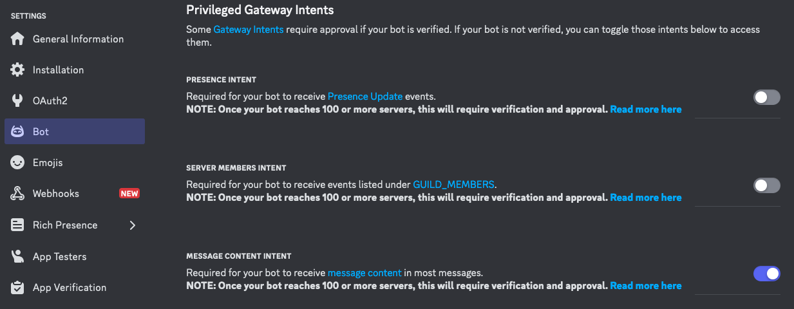
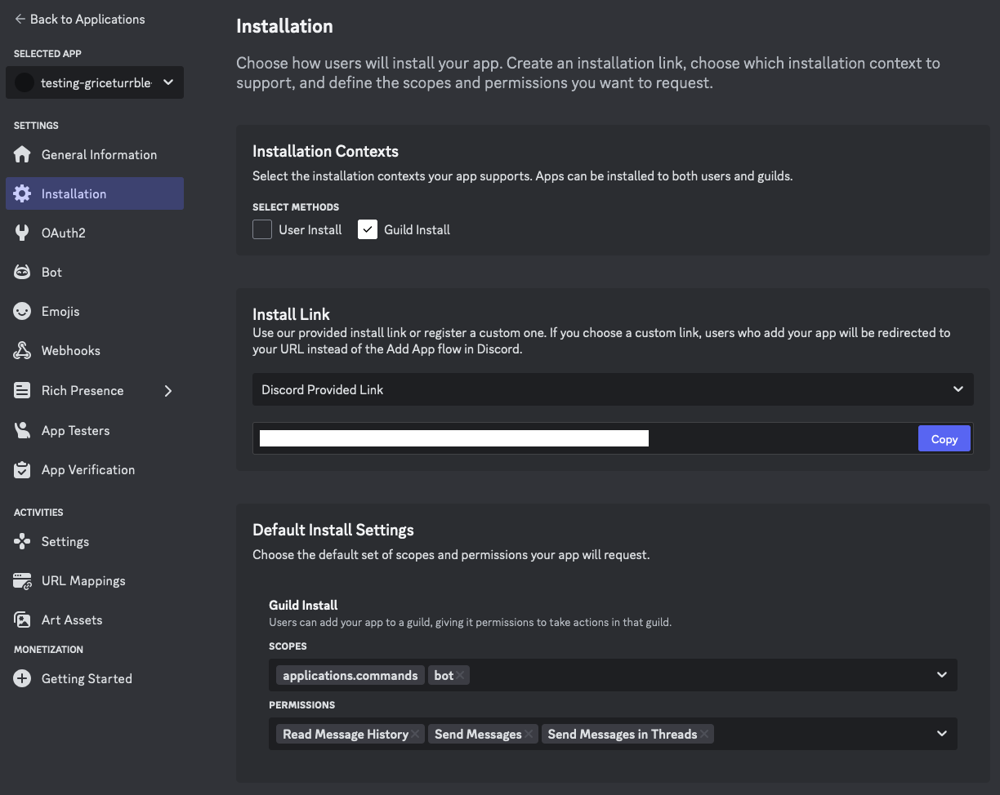
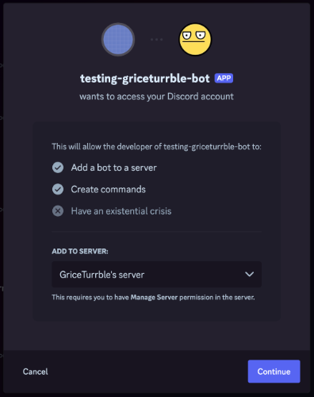

# Getting started

## First time setup

Before you can run the bot, you will need to:

1. Install a few essential tools locally;
2. Create your bot application in [Discord Developer portal];
3. Grab your bot's Discord token; and
4. Invite the bot to your server.

Let's explore these in detail below:

## Install tools

To start, install necessary tooling to work on this project.

If you use [Homebrew],
you can take advantage of the `Brewfile` available
to install the bundle of tools:

```shell
brew bundle install
```

Otherwise, please follow installation instructions for each of the following minimal tools:

- [just], a command runner similar to Make.
- [pre-commit], a framework for managing pre-commit hooks (used for code quality).
- [uv], a Python package and project manager.

Most other tooling uses the `Justfile` recipes or standard `uv` commands.

!!! note

    `uv` can handle Python installations for you, if you want it to.
    Otherwise, you can install **Python 3.12** yourself from [python.org],
    or use a version manager like [pyenv].

## Bootstrap environment

!!! note

    Run `just help` (or `just` by itself) to display help documentation about the commands available in the Justfile.

    For more details on Just, refer to the [Just manual].

Bootstrap your environment using `just bootstrap`.
This performs a few helpful steps, such as `pre-commit install` to get pre-commit hooks set up for you,
and `uv sync` to initialize your Python virtual environment
(you will find it as a `.venv` folder inside the project).

You'll also find a new `.env` file is added,
containing some environment variable definitions:

```sh
# Get your Discord token from the Discord dev console
# THIS IS CONFIDENTIAL! DO NOT SHARE YOUR TOKEN!
DISCORD_TOKEN=
# Copy the guild ID (aka server ID) from a target private server.
# If present, some commands become private to this guild only.
# Otherwise, all commands are globally available for all bot installs.
# DISCORD_GUILD=
```

## Setup your Discord bot app

If you don't have a Discord bot application set up in [Discord Developer portal] yet,
head there now and make one!

### Setup intents and permissions

Setting up slash commands is relatively simple.
In fact, very few, if any, of the following steps are necessary if your bot only uses slash commands.

Using message content for other types of commands is slightly more complex,
requiring extra permission settings in the portal _and_ in the code.

We've got you covered on the code side (as explained more in [Anatomy of a Discord Bot](explore.md)).
To set up the permissions in the portal, first open the **Bot** section of your application,
then scroll to **Privileged Gateway Intents**:



In order to read message content, the **Message Content Intent** toggle must be enabled
(the bottom toggle in the above screenshot).
Make sure to click **Save** for these changes to take effect!

**Next**, head to the **Installation** tab.
For the simplest method to authorize the bot on your server,
choose **Guild Install** for an Installation Context,
then select **Discord Provided Link** as an Install Link.

Further down the same page, under **Default Install Settings**,
click into the "Scopes" dropdown and select `bot`.
A new dropdown should appear for "Permissions".
Select, at minimum, the following:

- `Read Message History`
- `Send Messages`
- `Send Messages in Threads`

With all of these selected, your page may look like so
(I've crossed out the install link for my test bot :slight_smile:):



**Save** this page, as well!

**Finally**, copy the Install Link that was created.
It should look something like this:

```
https://discord.com/oauth2/authorize?client_id=12345
```

Paste your link into your browser,
then follow the onscreen instructions to install the bot on your server:



### Grab your bot token

Back in the **Bot** tab in the portal, you can create a token for your bot
by clicking the **Reset Token** button.

Copy this token and paste it into your `.env` file as `DISCORD_TOKEN`:

```
DISCORD_TOKEN=superSecretTokenValue12345
```

!!! warning

    Discord bot tokens are confidential, and should never be shared with anyone!
    You may want to keep a copy of the token value in a password manager like (1Password or Bitwarden),
    but otherwise it should _never_ be committed to your git repo!

    The `.env` file containing that secret remain ignored (via `.gitignore`),
    and you should _only_ use the `DISCORD_TOKEN` environment variable to access it temporarily
    (be wary of any `print()` or `logging` calls that may expose it, as well!).

    If your bot token is ever leaked to someone who should not have it,
    head back to the Developer Portal and reset that token right away to invalidate their access.

## Starting the bot

Once all the setup steps are completed,
you can start the bot using `uv run disbot`
(or its Justfile alias, `just up`):

```sh
$ uv run disbot
2024-12-30 16:31:26 WARNING  discord.ext.commands.bot Privileged message content intent is missing, commands may not work as expected.
2024-12-30 16:31:26 INFO     discord.client logging in using static token
2024-12-30 16:31:27 INFO     discord.gateway Shard ID None has connected to Gateway (Session ID: ...).
Logged in as my-bot#1234 (ID: ...)
```

You should then be able to test the `/hello` and `!whatsup` commands
(configured in the original template source)
in one of the channels of your server:


[Discord Developer Portal]: https://discord.com/developers/applications
[just]: https://just.systems/
[just manual]: https://just.systems/man/en/
[pre-commit]: https://pre-commit.com/
[uv]: https://docs.astral.sh/uv/
[Homebrew]: https://brew.sh/
[python.org]: https://python.org/downloads
[pyenv]: https://github.com/pyenv/pyenv
