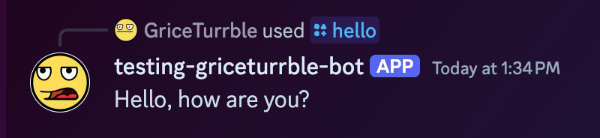
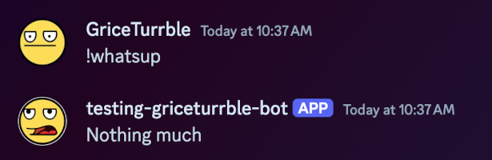

# Discord bot template

[Use this template :material-github:](https://github.com/new?template_name=discord-bot-template&template_owner=GriceTurrble){
.md-button .md-button--primary }

A simple template for a [Discord] bot using [discord.py], providing the essential tooling and basic
building blocks for writing your own custom Discord bot in minutes, with minimal bells and whistles
attached.

The template includes two "hello world"-style commands as a demonstration. Use these as a basis for
adding new commands for your own special bot.

Further, the documentation (that you are reading right now!) serves as a guide for newcomers to
understand all the inner workings of a Discord bot, some best-practice patterns to follow, and links
to pertinent documentation on discord.py itself.

:material-robot: Happy botting!

## Running the demo bot

To start the demo bot:

1. Clone [the template repo](https://github.com/GriceTurrble/discord-bot-template);
2. Follow the [setup instructions](getting_started.md), adding your own Discord bot token and
   Guild/Server ID; and
3. Start the bot with `uv run thebot` (or `just up` as an alias).

When running and installed in your server, you get a simple bot that can respond to a Slash Command,
`/hello`:

...and a standard message command, `!whatsup`:

After that, you can check out [Anatomy of a Discord Bot](explore.md) for an in-depth explanation of
how the bot works. Use this as a guide to making your own bot that can do whatever you want!

## About this template

This is a relatively simple Discord bot that responds to just two commands. It does not include
other features that might make a bot more useful, such as any integrations with databases, APIs,
etc. These are left as an exercise for the reader.

The template and this documentation are not affiliated with either [Discord] or the [discord.py]
package. Please use the discord.py docs as a more complete reference for this package, and please
direct any Discord-related issues to [Discord support].

## About the author

:wave: I'm [GriceTurrble](https://github.com/griceturrble), a software developer who's been working
with Python since 2014. I am occasionally active on [Python Discord] (or "PyDis", as some call it),
where I offer advice and bad jokes to newcomers to the language and to programming in general.

I am no expert in Discord bots or the discord.py package in particular, but I love teaching folks
new things. I wrote this template and its documentation from scratch, both to expand my own
knowledge about it and, hopefully, to share those learnings with others.

[discord]: https://discord.com/
[discord support]: https://support.discord.com/hc/en-us
[discord.py]: https://discordpy.readthedocs.io/
[Python Discord]: https://www.pythondiscord.com/
