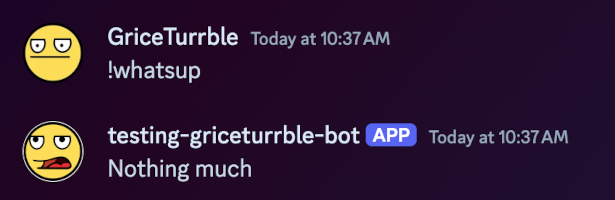

# DisBot: simple Discord bot template

[Use this template :material-github:](https://github.com/new?template_name=disbot&template_owner=GriceTurrble){ .md-button .md-button--primary }

**DisBot** is a simple template for a [Discord] bot using [discord.py].

You can use the template and this documentation together to learn more about
making your own Discord bot that responds to Slash Commands:

...or standard message commands:

Ready to [get started](getting_started.md) setting up the bot?

Or you can [explore](explore.md) the fine details.

## About this template

This is a relatively simple Discord bot that responds to just two commands.
It does not include other features that might make a bot more useful,
such as any integrations with databases, APIs, etc.
These are left as an exercise for the reader.

The template and this website are also not affiliated with either [Discord] or [discord.py].
Please use the discord.py docs as a more complete reference for this package,
and please direct any Discord-related issues to [Discord support].

## About the author

:wave: I'm [GriceTurrble](https://github.com/griceturrble),
a software developer who's been working with Python since 2014.
I am occasionally active on [Python Discord] (or "PyDis", as some call it),
where I offer advice and bad jokes to newcomers to the language
and to programming in general.

I am no expert in Discord bots or the discord.py package in particular,
but I love teaching folks new things.
I wrote this small template and its documentation from scratch,
both to expand my own knowledge about it
and, hopefully, to share those learnings with others.

[discord]: https://discord.com/
[discord support]: https://support.discord.com/hc/en-us
[discord.py]: https://discordpy.readthedocs.io/
[Python Discord]: https://www.pythondiscord.com/
